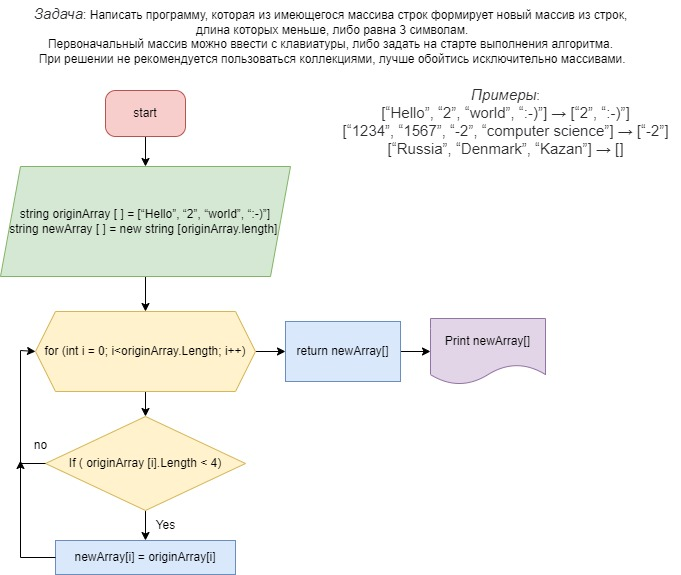

1. Для решения задачи запрашиваем у пользователя ввести длинну массива.
2. Создаем пустой массив с длинной указанной пользователем.
3. Далее через цикл *for* и *convert.ToString* заполняем массив обьявленной длинны значениями от пользователя.
4. Далее создаем второй такой же длинны.
5. Передаем оба массива в метод, указанный в Блок-схеме.
6. Возвращаем новый масив. 
7. Выводим новый масив на печать.
